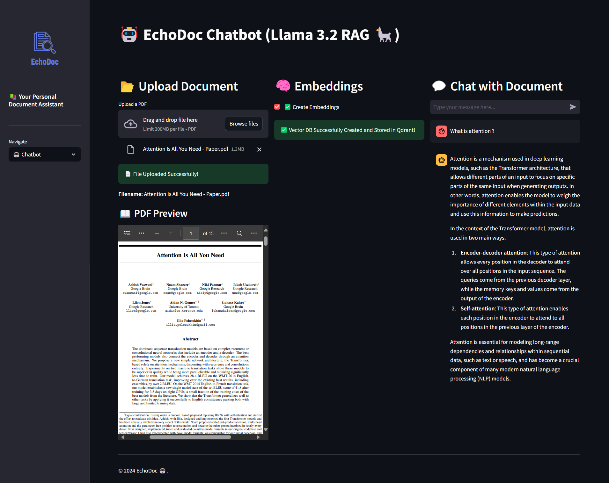

# 🤖 EchoDoc



**EchoDoc** is a real-time **Retrieval Augmented Generation Application** for document search and question answering, combining vector search with LLM capabilities to retrieve and generate contextual information. 🚀


## 🛠️ Features

- **📂 Upload Documents**: Easily upload and preview your PDF documents within the app.
- **🧠 Create Embeddings**: Generate embeddings for your documents to enable efficient search and retrieval.
- **🤖 Chatbot Interface**: Interact with your documents using a smart chatbot that leverages the created embeddings.
- **📧 Contact**: Get in touch with the developer.
- **🌟 User-Friendly Interface**: Enjoy a sleek and intuitive UI with emojis and responsive design for enhanced user experience.

## 🖥️ Tech Stack

The EchoDoc leverages a combination of cutting-edge technologies to deliver a seamless and efficient user experience. Here's a breakdown of the technologies and tools used:

- **[LangChain](https://langchain.readthedocs.io/)**: Utilized as the orchestration framework to manage the flow between different components, including embeddings creation, vector storage, and chatbot interactions.
  
- **[Unstructured](https://github.com/Unstructured-IO/unstructured)**: Employed for robust PDF processing, enabling the extraction and preprocessing of text from uploaded PDF documents.
  
- **[BGE Embeddings from HuggingFace](https://huggingface.co/BAAI/bge-small-en)**: Used to generate high-quality embeddings for the processed documents, facilitating effective semantic search and retrieval.
  
- **[Qdrant](https://qdrant.tech/)**: A vector database running locally via Docker, responsible for storing and managing the generated embeddings for fast and scalable retrieval.
  
- **[LLaMA 3.2 via Ollama](https://ollama.com/)**: Integrated as the local language model to power the chatbot, providing intelligent and context-aware responses based on the document embeddings.
  
- **[Streamlit](https://streamlit.io/)**: The core framework for building the interactive web application, offering an intuitive interface for users to upload documents, create embeddings, and interact with the chatbot.

## 📁 Directory Structure

echodoc/
```
│── logo.png
├── app.py
├── vectors.py
├── chatbot.py
├── requirements.txt
```

### 🔗 Useful Links


•	Streamlit Documentation: https://docs.streamlit.io/

•	LangChain Documentation: https://langchain.readthedocs.io/

•	Qdrant Documentation: https://qdrant.tech/documentation/

•	ChatOllama Documentation: https://github.com/langchain-ai/langchain-llms#ollama
